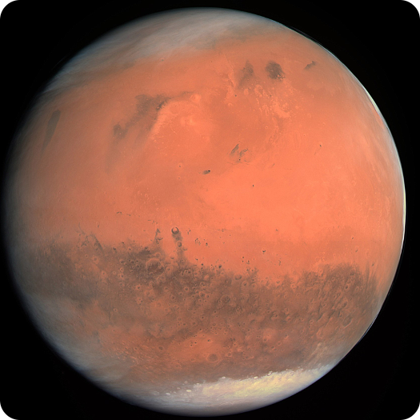

  <h1>
     
    The Mars Modules
  </h1>

  <blockquote>
    If there was an observer on Mars, they would probably be amazed that we have
    survived this long.
    
   <footer>-Noam Chomsky, <cite>Earth</cite></footer>

  </blockquote>

## what
These were a collection of my terraform modules. Most are about doing AWS things
with Rust. 

I've since stopped using terraform, and have moved to my own IaC solution, [teleform](https://github.com/schell/teleform).

## why
Why not?

## how
Terraform
